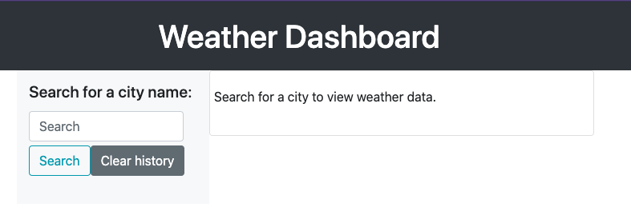
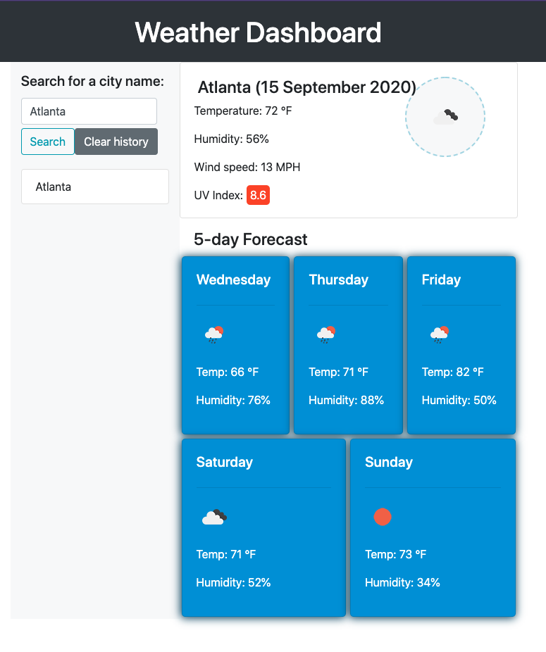
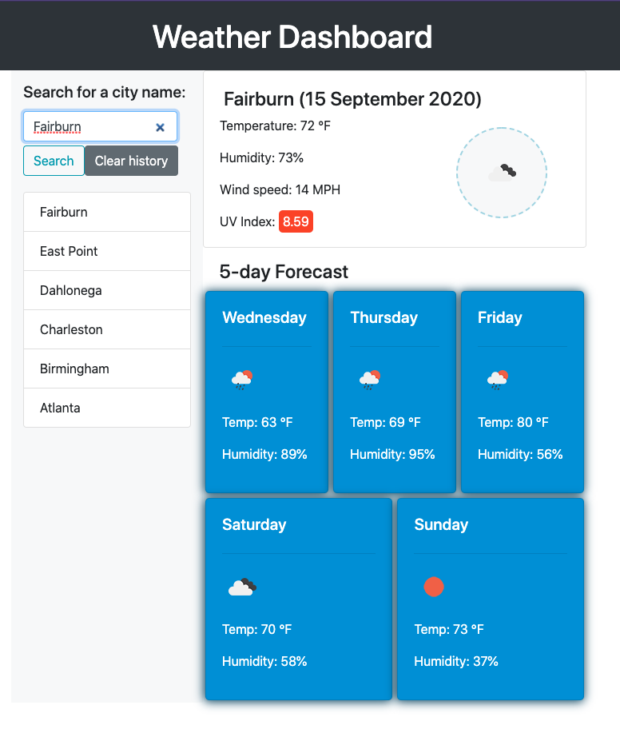

# Weather Dashboard
Use this simple weather app to view the current weather conditions, as well as a 5-day forecast, for the city of your choice. Simply type in the name of a city and click "Search" to view the weather data.

Your search history will populate on the left side of the page. Click on a search history item to view the weather for that city again. Click the "Clear" button to clear your search history.

Live site: [judeclark19.github.io/weather-dashboard](https://judeclark19.github.io/weather-dashboard/)

GitHub Repo: [github.com/judeclark19/weather-dashboard](https://github.com/judeclark19/weather-dashboard)

***

## Screenshots

#### Before user interaction

#### After a user has entered a valid search term, weather data appears

#### When a user has entered more than one search term, the sidebar populates (and will eventually overflow with a scroll bar)

***

## Sources of Knowledge
[Convert a Unix Timestamp to a Date in Vanilla JavaScript](https://coderrocketfuel.com/article/convert-a-unix-timestamp-to-a-date-in-vanilla-javascript)

***

## License
MIT License

Copyright (c) 2020 Jude Clark

Permission is hereby granted, free of charge, to any person obtaining a copy
of this software and associated documentation files (the "Software"), to deal
in the Software without restriction, including without limitation the rights
to use, copy, modify, merge, publish, distribute, sublicense, and/or sell
copies of the Software, and to permit persons to whom the Software is
furnished to do so, subject to the following conditions:

The above copyright notice and this permission notice shall be included in all
copies or substantial portions of the Software.

THE SOFTWARE IS PROVIDED "AS IS", WITHOUT WARRANTY OF ANY KIND, EXPRESS OR
IMPLIED, INCLUDING BUT NOT LIMITED TO THE WARRANTIES OF MERCHANTABILITY,
FITNESS FOR A PARTICULAR PURPOSE AND NONINFRINGEMENT. IN NO EVENT SHALL THE
AUTHORS OR COPYRIGHT HOLDERS BE LIABLE FOR ANY CLAIM, DAMAGES OR OTHER
LIABILITY, WHETHER IN AN ACTION OF CONTRACT, TORT OR OTHERWISE, ARISING FROM,
OUT OF OR IN CONNECTION WITH THE SOFTWARE OR THE USE OR OTHER DEALINGS IN THE
SOFTWARE.